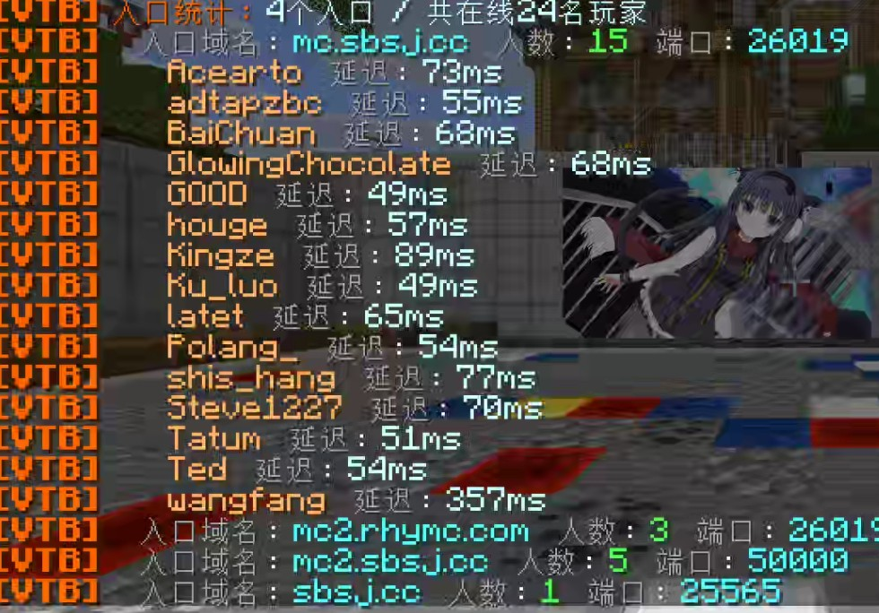

# VelocityToolBox

Hot plugin management, custom resource pack delivery and hosting, entry-domain diagnostics, and server version rules for Velocity.

Hosting and delivery have separate switches. Hosted `@file.zip` URLs get an automatic SHA-1. `/vtb pack check` reports configuration problems, status shows match reasons, and `resend all` works in batches. The pack host rate-limits public HTTP downloads.

[中文](../README.md) · [Wiki](https://github.com/polang233/VelocityToolbox/wiki/English) · [Releases](https://github.com/polang233/VelocityToolbox/releases) · [Hangar](https://hangar.papermc.io/polang/VelocityToolBox) · [Modrinth](https://modrinth.com/plugin/velocitytoolbox)

## Install

Put the JAR in the proxy's plugins/ directory and start the proxy. Current build target is Velocity 4 and Java 25. Grant `velocitytoolbox.admin` and run `/vtb help`. The full command name is `/vtoolbox`.

Version rules, HTTP hosting and pack delivery default to disabled. Replace example files and server names before enabling them. Apply configuration changes with `/vtb reload`.

When updating, replace the JAR and restart the proxy. Existing configuration still works: add `resource-packs` when you want pack delivery; leaving it out keeps delivery disabled. If you made few language changes, back up and move the old language files, then run `/vtb reload` to generate fresh copies. Reapply any custom text using the new keys.

## Modules

### Plugin management

`/vtb plugin list|inspect|load|unload|reload` lists, inspects and manages proxy plugins, including cleanup reports. Required dependencies prevent unloading. Restart the proxy when updating permission, protocol or connection plugins.

  

  

### Resource packs

`resource-packs` sets network-wide defaults and lets you choose packs by backend, client version and permission. `pack-host` serves local ZIPs, calculates hashes and limits downloads. Enable each module separately.

- `url: "@filename.zip"` uses VTB hosting with an automatic URL and SHA-1.
- External HTTP/HTTPS URLs download directly and require the actual hash.
- `url: "@"` sends nothing and needs no hosting.

For hosted files, `public-url` is the client's download address prefix. An empty value selects a local network address. Public servers need a reachable IP/domain with port forwarding or a reverse proxy.

pack-host is public HTTP with rate limits. Anyone who knows the full URL can download the ZIP. The ticket query parameter only correlates overload retries; it is not authentication.

Clients on 1.20.3+ can stack packs. Older clients receive the first matching complete pack. A selected required pack disconnects on rejection, failure or timeout. Use `/vtb pack list`, `status player` and `resend player|all` to inspect or resend packs. `/vtb pack check` checks configuration without applying it.

  

### Servers and entries

`/vtb server hosts` groups online players by their entry domain and shows ports and latency. Click an entry for player details.

  

`server-versions` restricts client versions per backend using min/max/allow/deny. It needs no ViaVersion and does not translate protocols.

  

## Status and documentation

`/vtb info` shows module status. `/vtb reload` reloads configuration and language without reloading other plugins.

[Modules and permissions](https://github.com/polang233/VelocityToolbox/wiki/Modules-English) · [Resource packs](https://github.com/polang233/VelocityToolbox/wiki/Resource-Packs-English) · [中文版本限制指南](https://github.com/polang233/VelocityToolbox/wiki/Server-Versions)

Messages support Simplified Chinese, Traditional Chinese, English and custom MiniMessage language files. Set language to zh_tw for Traditional Chinese, or leave it empty to follow the system locale. Unsupported languages fall back to Simplified Chinese. bStats can be disabled in its configuration.

[Issues](https://github.com/polang233/VelocityToolbox/issues) · [Maintenance notes](maintainer/README.md)
