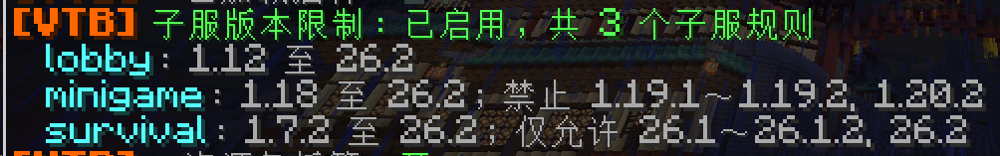

# 子服客户端版本限制

VelocityToolbox 在玩家连接目标子服前检查客户端协议。模块直接使用 Velocity 的 `Player.getProtocolVersion()`，代理端和子服都不需要为这项检查安装 ViaVersion。跨版本进入子服所需的协议转换仍由 ViaVersion 等兼容插件负责。

## 启用与配置



编辑 `plugins/VelocityToolbox/config.yml` 的 `server-versions` 段。默认 `enabled: false`；已有配置缺少该段时保持关闭，可按下面的示例添加。加载规则不会覆盖已有配置和语言文件。

```yaml
server-versions:
  enabled: true
  servers:
    lobby:
      min: "1.12"
      max: max
    survival:
      allow: ["1.12.2", "1.20.1"]
    minigame:
      min: "1.18"
      deny: ["1.19.1", "1.20.2"]
```

服务器名对应 `velocity.toml` 的 `[servers]`，匹配时忽略大小写。未列出的子服不限制。`servers: {}` 表示不配置任何子服规则。未知服务器名会在加载时告警，规则会在同名子服注册后生效。

- `min` / `max`：最低和最高协议，包含边界。省略时使用当前 Velocity 支持的最低和最高版本。`min: min`、`max: max` 也表示这两个端点，升级 Velocity 后随代理支持范围更新。
- `allow`：允许列表。省略或 `[]` 表示不额外限定；非空时只能进入列出的协议。
- `deny`：禁止列表，优先拒绝。省略或 `[]` 表示没有禁止项。
- 同时配置范围和 `allow` 时，必须同时满足两者，且不能命中 `deny`。

版本名称必须加引号，如 `"1.20"`。也可使用当前 Velocity 认识的整数协议号，如 `340` 表示 1.12.2。`"1.12"` 是 1.12 的协议，不是 1.12.x 通配符；允许整个 1.12 系列可设置 `min: "1.12"`、`max: "1.12.2"`。

修改后执行 `/vtoolbox reload` 或 `/velocity reload`，用 `/vtoolbox info` 查看模块开关、规则数量，以及按名称排序的各子服版本范围、允许列表和禁止列表。显示的是当前生效的规则，重载失败时仍显示上次有效规则。重载影响之后的连接请求，不踢出已经进入子服的玩家。将 `server-versions.enabled` 改为 `false` 后重载即可关闭模块。模块与资源包托管分别解析，一方重载失败不阻止另一方尝试重载。

## 拒绝行为与配置错误

切服被拒时，玩家留在当前子服，并收到版本要求与自身版本范围，聊天提示可悬停查看协议号。首次连接或当前已无子服连接时，会断开并显示版本要求与自身版本；不会自动选择另一个入口服。入口服应允许你希望接待的客户端版本。

模块在 `ServerPreConnectEvent` 的 `LAST` 顺序检查此前监听器改向后的目标。它保留已有的拒绝结果。其它路由插件需要在这之前完成改向，不能在本模块检查之后重新放行或再次改向。

不认识的版本、错误的列表格式、拼错的选项和反向范围都会使重载失败，并在日志中指出配置路径；上次有效规则继续生效。若首次加载失败，没有可用旧规则，模块会拒绝所有子服连接。修复文件或设置 `server-versions.enabled: false` 后，从代理控制台执行 `/vtoolbox reload` 恢复。

中英文提示位于 `lang/zh_cn.yml` 和 `lang/en_us.yml` 的 `server-versions` 段。旧语言文件缺少的新键会从随包文件补齐。自定义拒绝提示可使用 `<server>`、`<version>`、`<protocol>`、`<requirement>` 占位符。

## 协议识别边界

Minecraft 多个补丁版本可能共用一个协议。例如 1.20 与 1.20.1 都是 763，配置任何一个都会同时匹配两者；1.18 与 1.18.1 也一样。范围下限显示该协议对应的最早版本，上限显示最晚版本。允许列表、禁止列表和玩家版本把同协议版本合并为紧凑范围，例如 `1.7.2～1.7.5`、`1.18～1.18.1`；单个版本仍显示 `1.12.2`。`/vtoolbox info` 的规则行和切服拒绝提示可悬停查看协议号。仅凭握手协议无法进一步区分共用协议的补丁版本。

模块检查 Java 连接协议。Geyser 玩家呈现的是 Geyser 使用的 Java 协议，不能据此限制基岩版自身的具体版本。玩家还必须能被当前 Velocity 接受；这个模块不会扩展代理或子服支持的协议范围。

API 依据：[入站连接的协议版本](https://jd.papermc.io/velocity/4.1.0/com/velocitypowered/api/proxy/InboundConnection.html#getProtocolVersion())、[Velocity 协议与版本别名定义](https://github.com/PaperMC/Velocity/blob/dev/3.0.0/api/src/main/java/com/velocitypowered/api/network/ProtocolVersion.java)、[连接前事件的实际目标](https://jd.papermc.io/velocity/4.1.0/com/velocitypowered/api/event/player/ServerPreConnectEvent.html)。

## 验证

运行 `./gradlew check jar`。其中 `serverVersionSmokeTest` 从打包后的 JAR 加载模块，在没有 ViaVersion 的类路径上读取真实 YAML，并调用实际的 `ServerPreConnectEvent` 监听，覆盖范围端点、协议别名、白名单与黑名单、目标改向、已有取消、首次进入、切服、配置重载和监听器清理。可加 `--args="/path/to/config.yml"` 校验待部署配置中的版本规则。

实服验收仍需在测试代理上完成：代理不装 ViaVersion，子服保留现有兼容插件；分别用允许和禁止的客户端测试首次登录、`/server` 切服、其它插件传送，以及修改配置后的重载。检查允许的连接能正常进入子服，拒绝的切服保留原服，首次拒绝显示完整原因。

## 使用统计

[](https://bstats.org/plugin/velocity/VelocityToolbox/33451)
